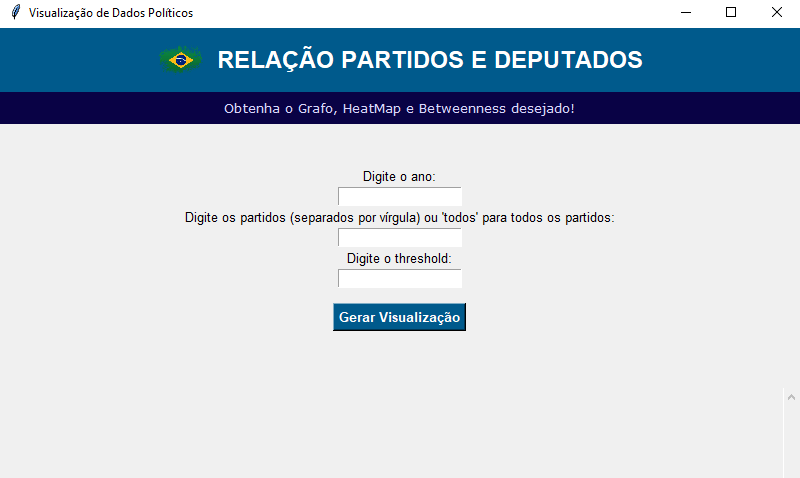
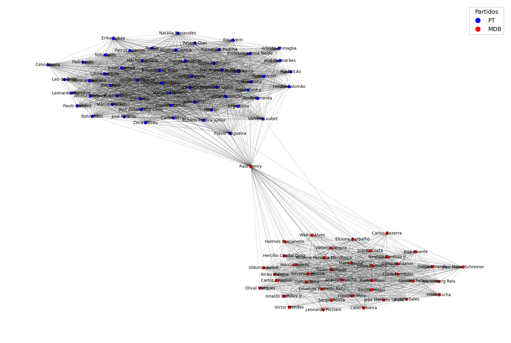
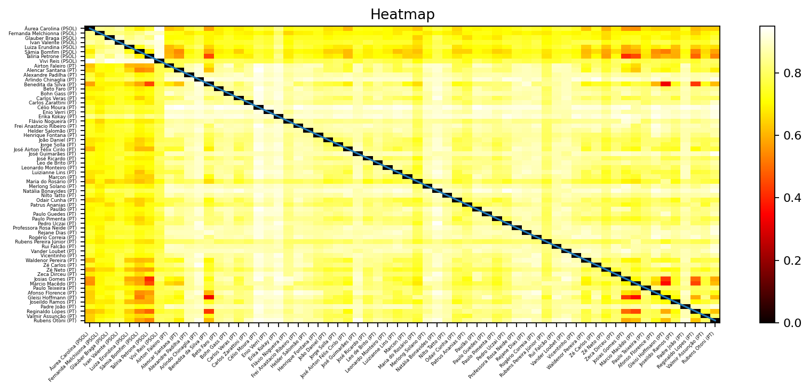
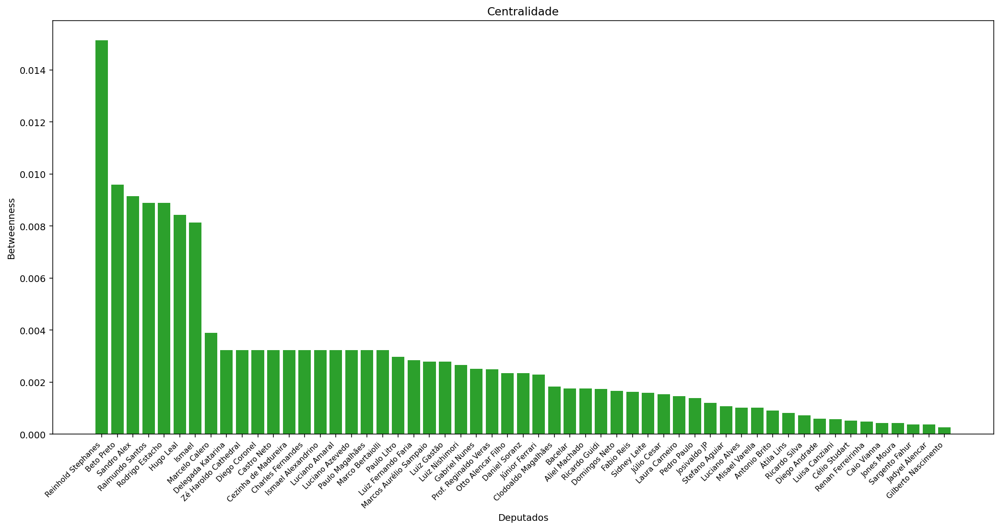

# 👩‍💻 Análise de Relações de Proximidade de Deputados Brasileiros

Através de uma aplicação intuitiva e visualmente atrativa desenvolvida com tkinter, é possível explorar as complexas relações de proximidade entre os deputados e partidos brasileiros. Esta ferramenta oferece uma análise abrangente e acessível do cenário político, promovendo uma compreensão mais profunda das dinâmicas parlamentares no Brasil.

Esta aplicação Python analisa as relações de proximidade entre deputados brasileiros e gera três tipos de gráficos:

- **Grafo**: Representação visual das ligações entre deputados.
- **Heatmap**: Mapa de calor que mostra as relações de proximidade.
- **Betweenness**: Medida de centralidade na rede.

## 🖥️ Interface Gráfica

## 📊 Gráficos

### Grafo

### Heatmap

### Betweenness

## ⚙️ Requisitos

- Python 
- Bibliotecas: `matplotlib`, `networkx`, `numpy`

## ✍️ Autor

- Emanuelle Ferraz Lima
- Mateus Henrique Santos
